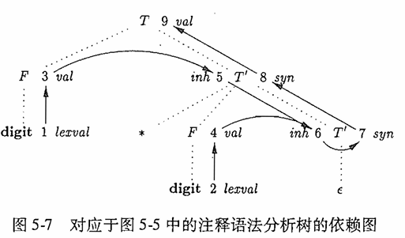
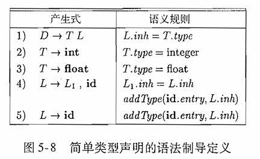
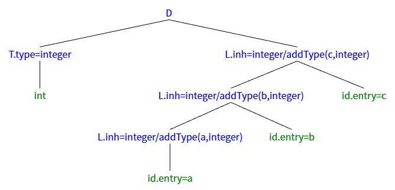
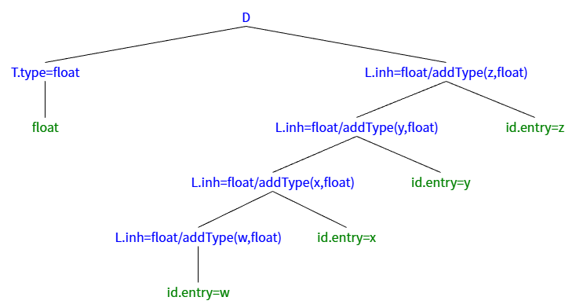
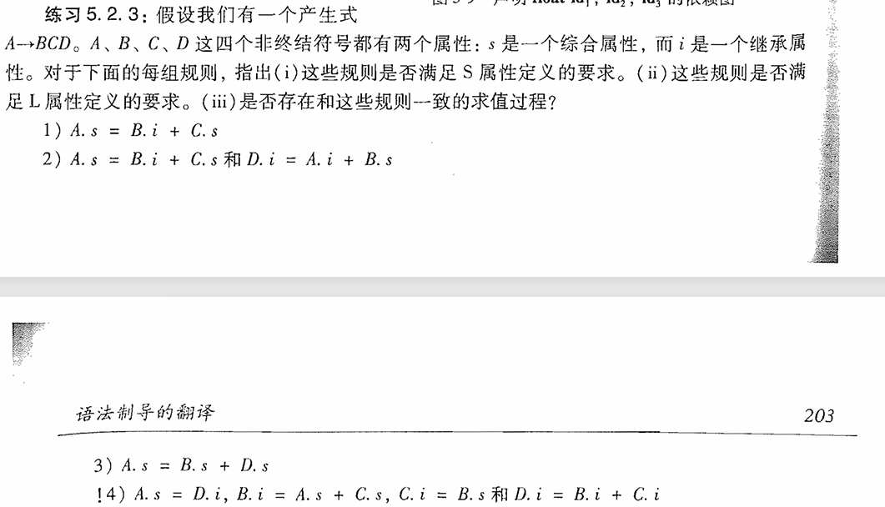

#### 5.2节练习
## 练习5.2.1
- 图5-7中的依赖图的全部拓扑排序有哪些？
    
    1. 1-2-3-4-5-6-7-8-9
    2. 1-2-3-5-4-6-7-8-9
    3. 1-2-4-3-5-6-7-8-9
    4. 1-3-5-2-4-6-7-8-9
    5. 1-3-2-5-4-6-7-8-9
    6. 1-3-2-4-5-6-7-8-9
    7. 2-1-4-3-5-6-7-8-9
    8. 2-1-3-4-5-6-7-8-9
    9. 2-1-3-5-4-6-7-8-9
    10. 2-4-1-3-5-6-7-8-9
## 练习5.2.2
 对于图5-8中的SDD，给出下列表达式对应的注释语法分析树。
    
- (1)int a, b, c
 - 解： 
 
- (2)float w, x, y, z
 - 解：
## 练习5.2.3

- (1)
  - （i）由于存在继承属B.i所以不是S属性的
  - （ii）是L属性的
  - （iii）存在。先获取B节点的继承属性B.i，然后处理B的子树，之后处理完C的子树后计算C的综合属性C.s，最后计算A的综合属性A.s。
- (2)
  - (i) 存在继承属性，不是S属性的
  - (ii) 符合L属性
  - (iii) 存在。先获取B的继承属性B.i，然后计算B的综合属性B.s，然后处理C的子树，处理完后计算出C的综合属性C.s，再处理D，计算出D的继承属性为A.i+B.s，再处理D的子树，处理完后计算出A的综合属性A.s=B.i+C.s。
- (3)
  - (i) 全部属性都是综合属性，是S属性的
  - (ii) 是L属性的
  - (iii) 存在。先处理B的子树，处理完后计算B的综合属性B.s，再处理D的子树，处理完后得D.s，然后计算A的综合属性A.s=B.s+D.s。
- (4)
  - (i) 存在继承属性，不是S属性的
  - (ii) B.i = A.s + C.s，存在继承属性对父节点综合属性和右兄弟属性的依赖，不是L属性的。
  - (iii) A.s->B.i->D.i->A.s，依赖图存在环，没有和规则一致的求值过程。
## 练习5.2.4
  
 | 产生式 | 语义规则 |
|--------|----------|
| S->L·L1 | S.val = L.val + L1.val L.side = left L1.side = right |
| S->L | L.side = left S.val = L.val |
| L->L1·B | L1.side = L.side; If(L.side == left){ &nbsp;&nbsp;L.val = L1.val * 2 + B.val; } If(L.side == right){ &nbsp;&nbsp;L.len = L1.len + 1; &nbsp;&nbsp;L.val = L1.val + B.val * pow(2, -L.len) } |
| L->B | If(L.side == left) L.val = B.val; If(L.side == right){ &nbsp;&nbsp;L.len = 1; &nbsp;&nbsp;L.val = B.val * 0.5; } |
| B->0 | B.val = 0; |
| B->1 | B.val = 1; |
## 🚧练习5.2.5-5.2.6
- 双！题目难度过大，等学完后面有空再更。