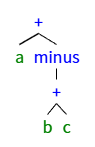
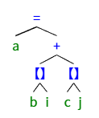
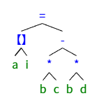
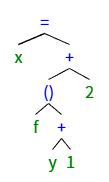
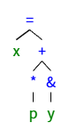

# 练习6.2.1 将算术表达式 a + - ( b + c)翻译为
- （1）抽象语法树
  - 
- （2）四元式序列
   |op|arg1|arg2|result|
   |--|----|----|------|
   |+|b|c|t1|
   |-|t1|  |t2|
   |+|a|t2|t3|
- (3)三元式序列
  |op|arg1|arg2|
  |--|----|------|
  |+|b|c|
  |minus|(0)|
  |+|a|(1)|

# 练习6.2.2 对下列赋值语句重复练习6.2.1
- （1）a = b[i] + c[j]
  - [1] 抽象语法树
  - 
  - [2] 四元式序列
  
   |op|arg1|arg2|result|
   |--|----|----|------|
   |*|w|i|t1|
   |=[]|b|t1|t2|
   |*|w|j|t3|
   |=[]|c|t3|t4|
   |+|t2|t4|t5|
   |=|t5| |a|
   - [3]三元式序列
  
   |op|arg1|arg2|
   |--|----|----|
   |*|w|i|
   |=[]|b|(0)|
   |*|w|j|
   |=[]|c|(2)|
   |+|(1)|(3)|
   |=|a|(4)|
- (2) a[i] = b * c - b * d
  - [1] 抽象语法树
 - 
  - [2] 四元式序列
  
   |op|arg1|arg2|result|
   |--|----|----|------|
   |*|b|c|t1|
   |*|b|d|t2|
   |-|t1|t2|t3|
   |*|i|w|t4|
   |[]=|t3|t4|a|
  - [3] 三元式序列
   
   |op|arg1|arg2|
   |--|----|----|
   |*|b|c|
   |*|b|d|
   |-|(0)|(1)|
   |*|w|i|
   |addr|a|(3)|
   |store|(4)|(2)|
- (3) x = f(y + 1) + 2
  - [1] 抽象语法树
  - 
  - [2] 四元式序列
  
   |op|arg1|arg2|result|
   |--|----|----|------|
   |+|y|1|t1|
   |param|t1|||
   |call|f|1|t2|
   |+|t2|2|t3|
   |=|t3||x|
  - [3] 三元式序列
   
   |op|arg1|arg2|
   |--|----|----|
   |+|y|1|
   |param|(0)||
   |call|f|1|
   |+|(2)|2|
   |=|x|(3)|
- (4) x = *p + &y
  - [1] 抽象语法树
  - 
  - [2] 四元式序列
  
   |op|arg1|arg2|result|
   |--|----|----|------|
   |*|p||t1|
   |&|y||t2|
   |+|t1|t2|t3|
   |=|t3| |x|
  - [3] 三元式序列
   
   |op|arg1|arg2|
   |--|----|----|
   |*|p||
   |&|y||
   |+|(0)|(1)|
   |=|x|(2)|
# 练习6.2.3：说明如何对一个三地址代码序列进行转换，使得每个被定值的变量都有唯一的变量名
- 使用静态单赋值SSA，确保所有不同名字的变量在代码中只被赋值一次。
  - （1）对同一变量的不同赋值使用下标区分，为每个变量维护一个计数器，从函数入口处遍历函数，遇到变量赋值为其产生新名字并替换。
  - （2）在分支汇合处使用Φ语句，用Φ(x1, x2 , ... )合并同一变量在不同分支的赋值