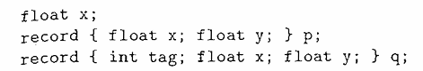

# 练习6.3.1
- 1.确定下列声明序列中几个标识符的类型和相对地址。
- 
- 解：
- 主符号表
     |名字|类型|偏移|
     |----|---|----|
     |x|float|0|
     |p|record(p)|8|
     |q|record(q)|24|
- p符号表
     |名字|类型|偏移|
     |----|---|----|
     |x|float|0|
     |y|float|8|
- q符号表
     |名字|类型|偏移|
     |----|---|----|
     |tag|int|0|
     |x|float|4|
     |y|float|12|

