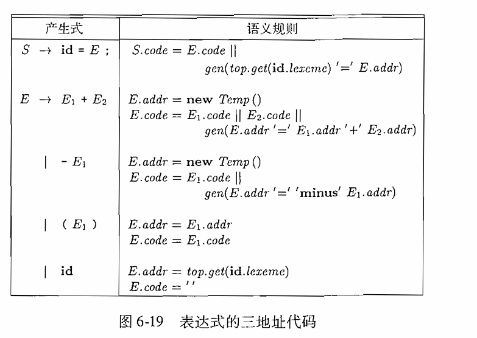
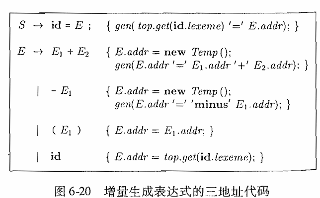
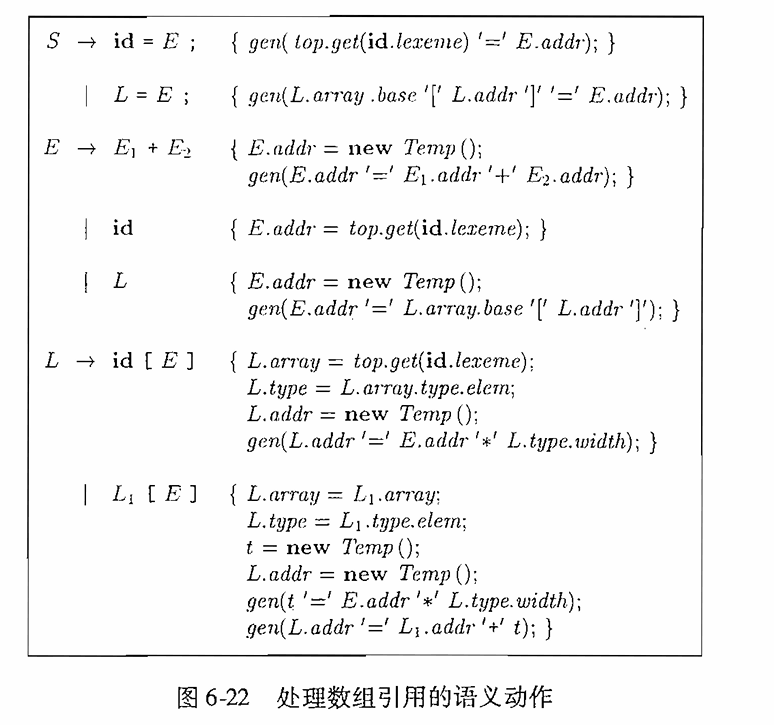
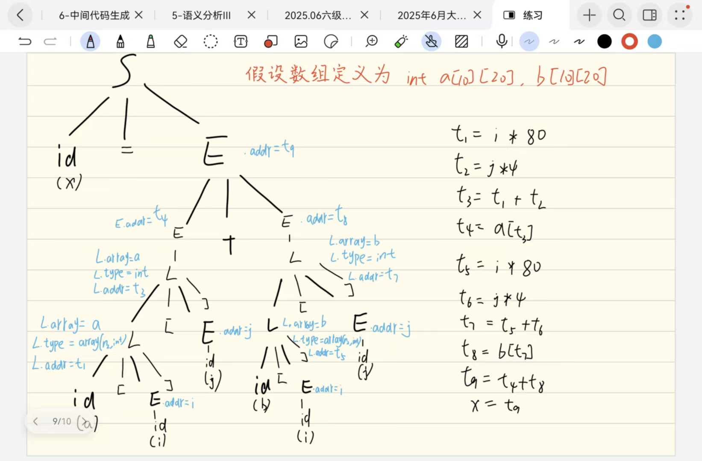
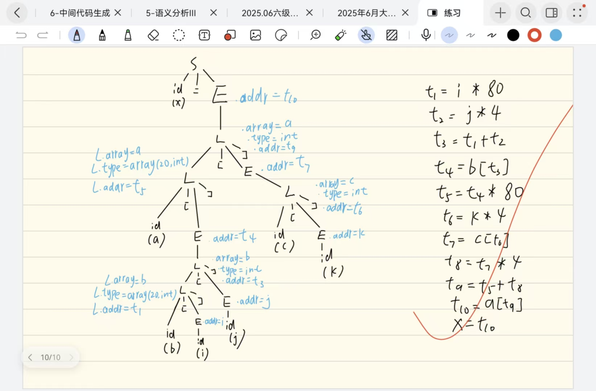
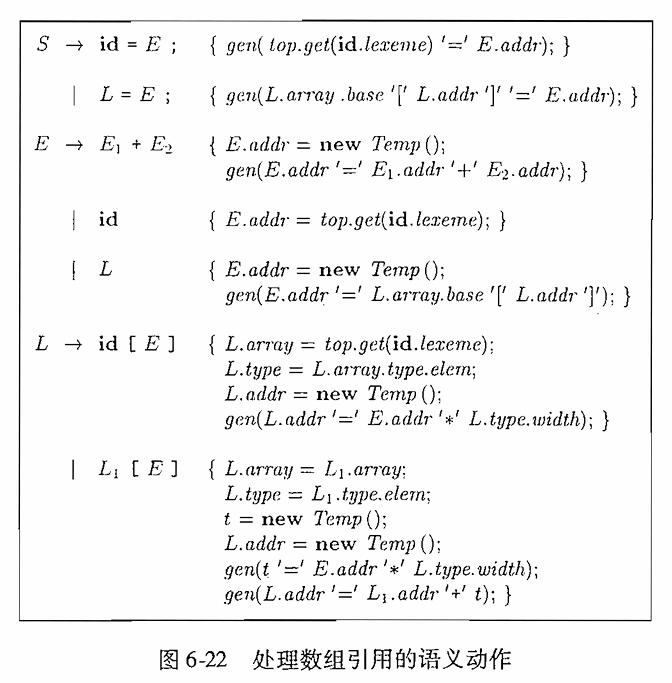
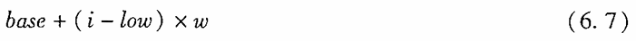

# 6.4节练习
## 练习6.4.1 向图6-19的翻译方案中加入对应于下列产生式的规则。

- （1）E -> E1 + E2
  
    - ``` SDD
       E -> E1 * E2 {E.addr = new Temp( ); 
                     E.code = E1.code || E2.code ||gen(E.addr '=' E1.addr '*' E2.addr);} 
- （2）E -> +E1
    - ```
      E -> + E1 {E.addr = E1.addr;
                 E.code = E.code;}
## 练习6.4.2 使用图6-20中的增量式翻译方案重复练习6.4.1

- （1）E -> E1 + E2
  
    - ``` 
       E -> E1 * E2 {E.addr = new Temp( ); 
                     gen(E.addr '=' E1.addr '*' E2.addr);} 
- （2）E -> +E1
    - ```
      E -> + E1 {E.addr = E1.addr;}
# 练习6.4.3 使用图6-22所示的翻译方案翻译下列赋值语句

- （1）x = a[i] + b[j]

- （2）x = a[i][j] + b[i][j]

- （3）x = a[b[i][j]][c[k]]

# 练习6.4.4
修改图6-22中的翻译方案，使之适合Fortran风格的数组引用，也就是说，n维数组的引用为id[E1, E2, ..., En]。

   - ```
     L -> T]    {L.array = T.array;
                 L.type = T.type;
                 L.addr = T.addr;}
     T -> T1,E  {T.array = T1.array;
                 T.type = T1.type.elem;
                 t = new Temp();
                 gen(t '=' E.addr '*' T.type.width);
                 T.addr = new Temp();
                 gen(T.addr '=' T1.addr '+' t)}
     T -> id [E {T.array = top.get(lexme);
                 T.type = T.array.type.elem;
                 T.addr = new Temp;
                 gen(T.addr '=' E.addr '*' T.type.width);}

# 练习6.4.5

- 将公式6.7推广到多维数组上，并指出哪些值可以被存放到符号表中并用来计算偏移量。考虑下列情况：
- 
- (1)一个二维数组A，按行存放。第一维的下标从l1到h1，第二维的下标从l2到h2.单个数组元素的宽度维w。
  - 解：$addr = base + (i - l_1) * (h2 - l_2 + 1) * w + (j - l_2) * w$
  - 可存放到符号表中的值
    - 虚拟基地址：$Const = base - (l_1 * n_2) * w - l_2 *w$
    - 各维度的跨度：$C_1 = n_2 * w，C_2 = w$
    - 运行时只需计算$Addr = Const + i * C_1 + j * C_2$
- (2)其他条件和1相同但是采用按列存放方式。
  - 解：$addr = base + (i - l_1) * w + (j - l2) * (h1 - l_1 + 1) * w$
  - 可存放到符号表中的值
    - 虚拟基地址: $Const = base - l_1 * w - l_2 * n_1 * w$
    - 各维度的跨度：$C1 = w, C2 = n1 * w$
- (3) 一个k维的数组A，按行存放，元素宽度为w，第j维的下标从lj到hj。
  - 解：$addr = base + ((...(((i_1 - l_1) * (h_2 - l_2 + 1) + (i_2 - l_2)) * (h_3 - l_3 + 1) + (i_3 - l_3))...) * (h_k - l_k + 1) + (i_k - l_k)) * w$
  - 可存放到符号表中的值：
    - （补充）跨度定义：
      - 第k维的跨度：$D_k = w$
      - 第k - 1维的跨度：$D_{k-1} = n_k \cdot w$
      - 第j维的跨度：$D_j = n_{j+1} \cdot D_{j+1}$ 
    - 各维度的跨度：$D_j$，用于运行时和下标$i_j$相乘。
    - 虚拟基地址：$base - \sum_{j=1}^{k}l_j \cdot D_j$
- (4) 其他条件和(3)相同，但是按列存放。
  - 解：$addr = base + ((...(((i_k - l_k) * (h_{k-1} - l_{k-1} + 1) + (i_{k-1} - l_{k-1})) * (h_{k-2} - l_{k-2} + 1) + (i_{k-2} - l_{k-2}))...) * (h_1 - l_1 + 1) + (i_1 - l_1)) * w$
    - 可存放到符号表中的值：
      - 跨度定义：
        - 第1维的跨度：$D_1 = w$
        - 第2维的跨度：$D_2 = n_1 \cdot w$
        - 第j维的跨度：$D_j = n_{j-1} \cdot D_{j-1}$
      - 各维度的跨度:$D_j$，用于运行时和下标$i_j$相乘
      - 虚拟基地址:$base - \sum_{i=1}^kl_j \cdot i_j$
  - 运行时地址计算公式$Address=C+∑_{i=1}^k(i_k×D_k)$
# 练习6.4.6 一个按行存放的整数数组A[i, j]的下标i的范围维1~10，下标j的范围维1~20.每个整数占4个字节。假设数组A从0字节开始存放，请给出下列元素的位置：
- （1）A[4, 5]
  - 解：$ addr = (4 - 1)\cdot 20 \cdot 4 + (5 - 1) \cdot 4 = 256$
- （2）A[10, 8]
  - 解：$addr = (10 - 1)\cdot 20\cdot 4 + (8 - 1)\cdot 4 = 748$
- （3）A[3, 17]
  - 解：$addr = (3 - 1) \cdot 20 \cdot 4 + (17 - 1) \cdot 4 = 224$
# 练习6.4.7：假定A是按列存放的，重复练习6.4.6
- （1）A[4, 5]
  - 解：$addr = (4-1)\cdot 4 + (5-1)\cdot 10 \cdot 4 =172 $
- （2）A[10, 8]
  - 解：$addr = (10 - 1)\cdot 4 + (8 - 1)\cdot 10\cdot 4 = 316$
- （3）A[3, 17]
  - 解：$addr = (3 - 1) \cdot 4 + (17 - 1) \cdot 10\cdot 4 = 648$
# 练习6.4.8一个按行存放的实数型数组A[i, j, k]的下标i的范围为1~4，下标j的范围为0~4，且下标k的范围为5~10.每个实数占8个字节。假设数组A从0字节开始存放。计算下列元素的位置。
- （1）A[3, 4, 5]
  - 解：$Addr = (3-1)\cdot 5\cdot 6\cdot 8 + (4-0)\cdot 6\cdot 8 + (5-5)\cdot 8 = 480 + 192 = 672$
- （2）A[1, 2, 7]
  - 解：$Addr = 2\cdot 6\cdot 8 + (7-5)\cdot 8 = 112 $
- （3）A[4, 3, 9]
  - 解：$Addr = (4-1)\cdot 5\cdot 6\cdot 8 + 3\cdot6 \cdot 8 + (9-5)\cdot 8 = 720 + 144 + 32 = 896 $
# 练习6.4.9：假定A是按列存放的，重复练习6.4.8
- （1）A[3, 4, 5]
  - 解：$Addr = (3-1)\cdot 8 + (4-0)\cdot 4\cdot 8 + (5 - 5)\cdot 5\cdot 4\cdot 8 = 16 + 128 = 144 $
- （2）A[1, 2, 7]
  - 解：$Addr = (1-1)\cdot 8 + (2-0)\cdot 4\cdot 8 + (7-5)\cdot 5\cdot 4\cdot 8 = 64 + 320 = 384 $
- （3）A[4, 3, 9]
  - 解：$Addr = (4-1)\cdot 8 + (3-0)\cdot 4\cdot 8 + (9-5)\cdot 5\cdot 4\cdot 8 = 24 + 96 + 640 = 760 $