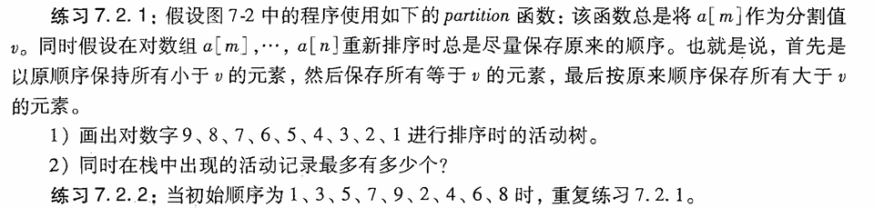
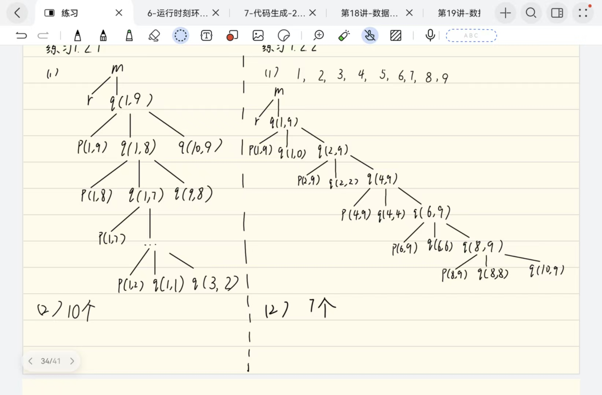
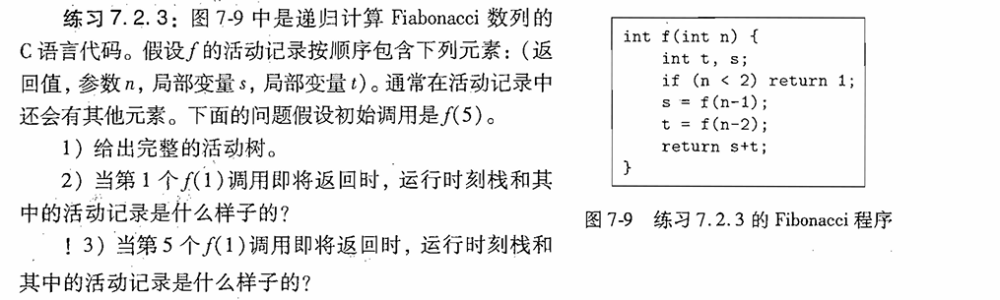
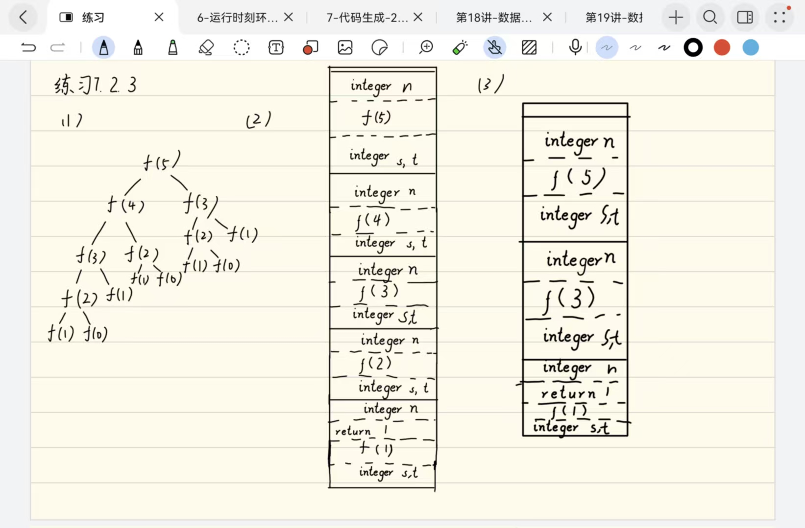
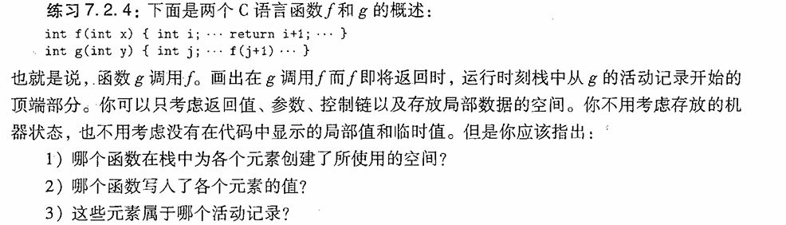
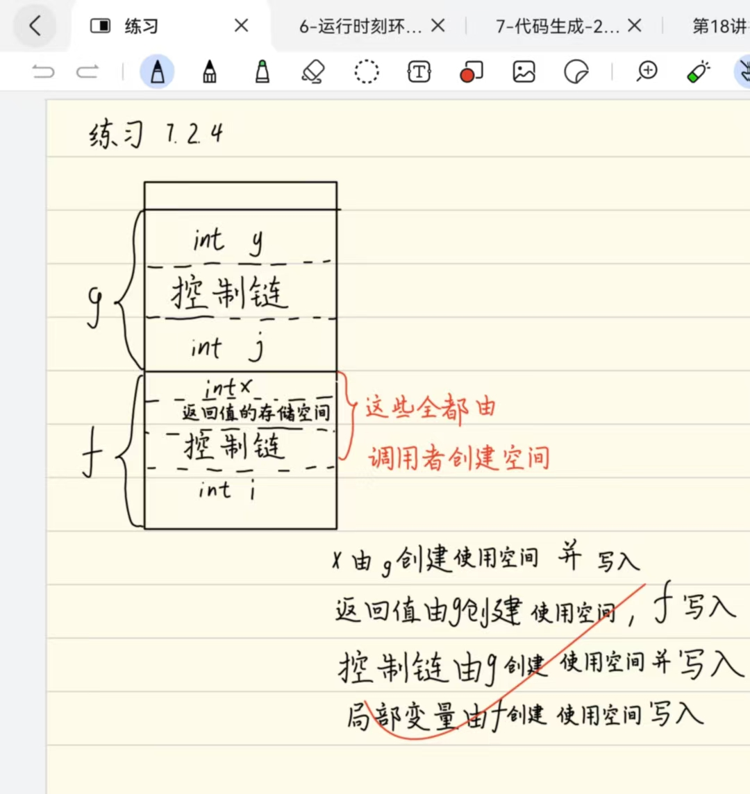
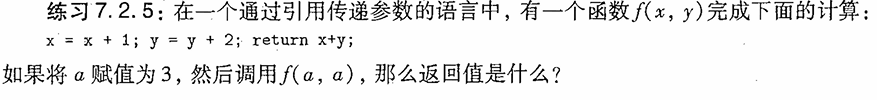
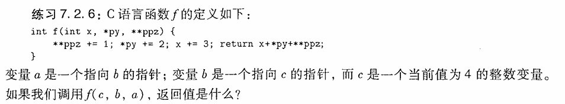

# 7.2节练习

## 练习7.2.1 / 7.2.2

- 解：

## 练习7.2.3

- 解：

## 练习7.2.4

- 解：

## 练习7.2.5

- 解：
  - (1) a = x = x + 1 = 4
  - (2) a = y = y + 2 = 6
  - (3) return x + y = 12

## 练习7.2.6

- 解：a -> b -> c = 4;
  f(a, b, c)
  - (1) **a = c = c + 1 = 5;
  - (2) *b += 2 <=> c += 2 -> c = 7
  - (3) x = x + 3 = 7
  - (4) return x + *b + **a = 7 + 7 + 7 = 21
  