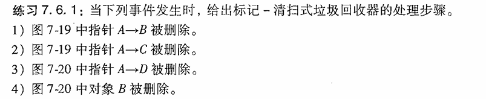
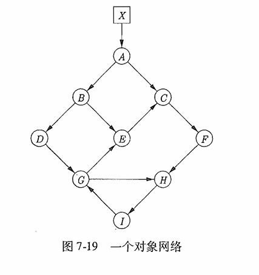
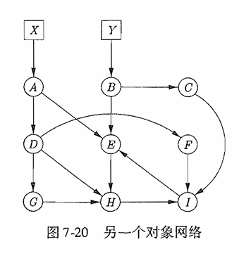

# 练习7.6.1

- (1)
    1. 从根集X开始遍历访问图。将Xreached设置为true并加入Unscanned集合。
    2. 从unscanned删除X。发现X有指向A的引用，将A的reached设置为true并加入unscanned集合
    3. 从unscanned删除A。发现A有指向C的引用，将C的reached设置为true并加入unscanned集合
    4. 从 unscanned 删除 C，将 F 标记为 reached 并加入 unscanned。
    从 unscanned 删除 F，将 H 标记为 reached 并加入 unscanned。
    5. 从 unscanned 删除 H，将 I 标记为 reached 并加入 unscanned。
    6. 从 unscanned 删除 I，发现 I 指向 G，将 G 标记为 reached 并加入 unscanned。
    7. 从 unscanned 删除 G。发现 G 指向 H（已标记，跳过）。发现 G 指向 E，将 E 标记为 reached 并加入 unscanned。
    8. 删除E后发现有指向C的引用但是C的reached已经被标记为true所以跳过。
    9. unscanned集合为空，循环结束。
    10. 遍历堆中全部内存块，对于reached未被标记为true的全部加入free集。对于reached被标记为true的将reached设置为false以便进行下一次标记清扫。
    11. 最终节点B, D被加入free集回收。
- （2）
    1. 从根集X开始遍历访问图。将Xreached设置为true并加入Unscanned集合。
    2. 从unscanned删除X。发现X有指向A的引用，将A的reached设置为true并加入unscanned集合。
    3. 从unscanned删除A。发现A有指向B的引用，将B的reached设置为true并加入unscanned集合
    4. 从unscanned删除B，将D、E标记为reached为true并加入unscanned。
    5. 从unscanned删除D，将G标记为reached为true并加入unscanned。
    6. 从unscanned删除E，将C标记为reached为true并加入unscanned。
    7. 从unscanned删除G，将H标记为reached为true并加入unscanned。处理E时发现已经被标记为reached为true跳过。
    8. 从unscanned删除C，将F标记为reached为true并加入unscanned。
    9. 从unscanned删除H，将I标记为reached为true并加入unscanned。
    10. 从unscanned删除F，处理H时发现reached字段已经被标记为true跳过即可。
    11. 从unscanned删除I，处理G时发现reached为true所以跳过。
    12. unscanned集合为空，循环结束跳出循环。
    13. 遍历堆中所有内存块，将reached字段为false的加入free集里，对于reached字段为true的将其置为false以便下次标记清扫。
    14. 本次标记清扫无节点被回收。

    (3)
    1. 将根集中的X, Y的reached标记为true并加入unscanned集合。
    2. 从unscanned删除X，将A的reached设置为true并将A加入unscanned集合。
    3. 从unscanned删除Y，将B的reached设置为true并将B加入unscanned集合。
    4. 从unscanned删除A，将E的reached设置为true并将E加入unscanned集合。
    5. 从unscanned删除B，将C的reached设置为true并将C加入unscanned集合。处理E时发现E的reached已经被标记为true故跳过。
    6. 从unscanned删除E，将H的reached设置为true并将H加入unscanned集合。
    7. 从unscanned删除C，将I的reached设置为true并将I加入unscanned集合。
    8. 从unscanned删除H，处理I时发现已经被标记为true故跳过。
    9. 从unscanned删除I，处理E时发现reached已经被标记为true故跳过。
    10. unscanned集合为空，循环结束跳出循环。
    11. 遍历堆中所有内存块，将reached字段为false的加入free集里，对于reached字段为true的将其置为false以便下次标记清扫。
    12. 本次清扫回收了D, G, F。

    (4)
    1. 将根集中的X, Y的reached标记为true并加入unscanned集合。
    2. 从unscanned删除X，将A的reached设置为true并将A加入unscanned集合。
    3. 从unscanned删除X，发现Y没有指向的引用故跳过。
    4. 从unscanned删除A，将D, E的reached设置为true并将D, E加入unscanned集合。
    5. 从unscanned删除D，将G, H, F的reached设置为true并将G, H, F加入unscanned集合。
    6. 从unscanned删除E，处理H时发现reached已经被标记为true故跳过。
    7. 从unscanned删除G。
    8. 从unscanned删除H，将I的reached设置为true并将I加入unscanned集合。
    9. 从unscanned删除F，处理I时发现reached已经被标记为true故跳过。
    10. 从unscanned删除I，处理E时发现reached已经被标记为true故跳过。
    11. unscanned集合为空，循环结束跳出循环。
    12. 遍历堆中所有内存块，将reached字段为false的加入free集里，对于reached字段为true的将其置为false以便下次标记清扫。
    13. 本次清扫回收了B, C。

## 练习7.6.3

- (1) A:0, C:100, E:200, F:300, G:400, H:500, I:600
- (2)地址均未发生变化
- (3)A:0, B:100, C:200, E:300, H:400, I:500
- (4)A:0, D:100, E:200, F:300, G:400, H:500, I:600
